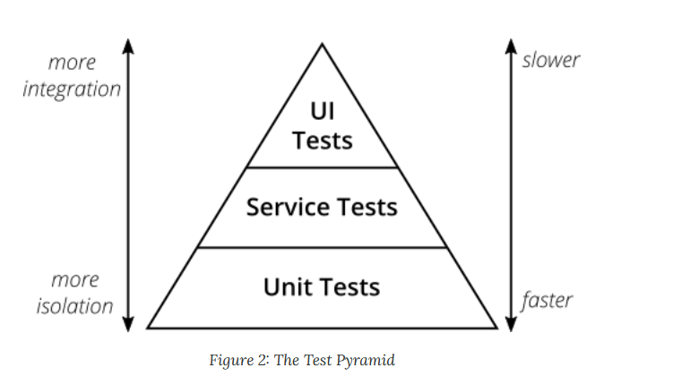
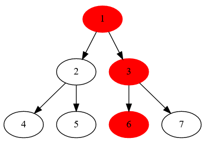
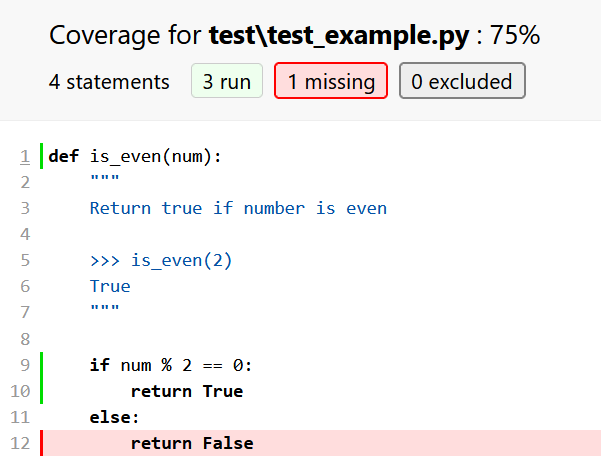
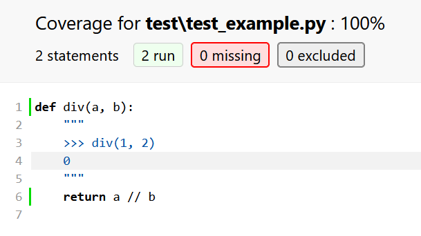

# Testing 

- When?
- Why?
- How?

---

## When? 

Always,

but:
- This code will be thrown away soon 
  - Challenge solving on www.haccerrank.com,  www.leetcode.com, etc
  - Code that runs once
  - Code that does not require quality: prototypes, POC (proof of concept) 
- Technical code that has a single purpose and run automatically
  - Automation scripts

---
 
## Why?

- To be sure that your code do what you ask it to do (finding bug is a side effect)
- Get fast and precise feedback 
- Improve speed of introducing changes
- Reduce time spent in debugging
- Remove fear of changes
- Force you to have an architecture (boundaries management)
- You think what you write 
- Tests are code documentation

---

## How?

- Tests are first class Citizens,
  it is a part of the project as important as code, deployment and configuration
- Rules for writing code and tests are different
- Write code with tests in mind,
  if your code is in untestable shape it will be a pain to test it
- Start writing tests from the beginning. 
  Don't wait a miracle that says it's time to write tests!

---

## What kind of test do we have?

<details>
  <summary>2 main groups</summary>
  
- Functional
- Non functional

</details>


<details>
  <summary>First group</summary>

- Functional
  - Unittest (we are talking about them today)
  - Not unittests: component, servce, integration, end-to-end
</details>


<details>
  <summary>Second group</summary>

- Non functional:
  - performance
  - stress
  - security

</details>
 
Don't try to write test that fits into multiple categories at once. 
They will be bad in all of them.

## What is unit stands for?

- function
- class
- method
- module
- package
- service

Unit is a chunk of code that can be tested.
No global definition need to define it for each project.

## A test is not a unit test if:
- It talks to the database
- It communicates across the network
- It touches the file system
- It can't run at the same time as any of your other unit tests
- You have to do special things to your environment (such as editing config files) to run it. 

[Michael Feathers. A Set of Unit Testing Rules](https://www.artima.com/weblogs/viewpost.jsp?thread=126923)

## Test pyramid

Many easy and fast tests, less slow and complicated tests.



## Let's have the example
Issue in a module fails each dependent module.

- Module 6 is on level 1 and has 0 dependencies
- Module 3 is on level 2 and has 2 dependencies
- Module 1 is on level 3 and has 6 dependencies

On which level it is better to catch error in module 6?



## Example with code

We have a feature that accepts an image, 
detects its attributes and provides an info about image.
To test each case we need to provide a separate image.

We wrote a bunch of functions:
- First level `get_color` and `get_shape` 
- Second level `get_image_info`

```python
def get_color(img) -> str:
    """Return one of colors from Red, Green, Blue."""


def get_shape(img) -> bool:
    """Return one of shapes: Box, Circle."""

def get_image_info(img):
    shape = get_shape(img)
    color = get_color(img)
    return f"This is {color} {shape}."
```

## Test from the top (reversed test pyramid)

We want to test all positive scenarious, so we provide an image for each possible case.

- `get_image_info` gives us 6 positive tests and 6 images (3 colors x 2 shapes )
    - test_red_box
    - test_red_cycle
    - test_green_box
    - test_green_cycle
    - test_blue_box
    - test_blue_cycle


| Function        | Tests | 
| --- | --- |
| get_color       | 0     | 
| get_shape       | 0     | 
| get_image_info  | 6     | 
| **Total:**      | **6** |
  
## Test from the bottom (test pyramid)

- `get_color` gives us 3 test and 3 images,
   we test that color was detected
    - test_red
    - test_blue
    - test_green
- `get_shape` gives us 2 test and 2 images,
  we test that shape was detected
    - test_box
    - test_cycle
- `get_image_info` gives us 1 test 1 image, 
   we test that `get_color` and `get_shape` returned value is properly formed.
   Actually you need 0 images, because you mock level 1 calls
    - test_image_info

| Function        | Tests | 
| --- | --- |
| get_color       | 3     | 
| get_shape       | 2     | 
| get_image_info  | 1     | 
| **Total:**      | **5** |

  
## Add a new color

```python
def get_color(img) -> str:
    """Return one of colors from Red, Green, Blue, Violent."""
```

- Test from the top
    - 4 * 2 -> 8 test 
- Test from the bottom
    - 4 + 2 + 1 -> 7 tests
  
| Function        | Top      | Bottom 
| --- | --- | --- |
| get_color       | 0        | 4 (+1)
| get_shape       | 0        | 2
| get_image_info  | 8 (+2)   | 1
| **Total:**      | **8**    | **7**

## Rename color 

```python
def get_color(img) -> str:
    """Return one of colors from Red, Green, Blue, Violet."""
```

- Test from the top
    - 2 test changes 
- Test from the bottom
    - 1 test changes

| Function        | Top changed      | Bottom changed 
| --- | --- | --- |
| get_color       | 0        | 1
| get_shape       | 0        | 0
| get_image_info  | 2        | 0
| **Total changed:**      | **2**    | **1**


Questions:

- Tests on which level are more independent of others?
- Tests on which level are more complex?
- Tests on which level have more reason to break?

## What test qualities we expect?

- independent, one test does not affect others
- informative, you can understand a case covered by the test  

## How we group tests
- Positive, sunny, critical path.
  These are the first tests you write, they check that feature you want works.  
- Negative. 
  You test how your code handles bad things, 
  like good message is provided when you put wrong data,
  or your code failed instead of providing any result.

## Tests are code but require different approach

- Test name can be long and descriptive, you never call it manually
- Input and expected values for each test are different even if they look the same, don't extract them to common variables 
- Make linter less strict for tests
- Treat them as code, review and maintain them
- Test should be flat, no condition check or loops should be used

## What should be tested

```python
def is_not_negative(a: int) -> bool:
    return a > 0
```

Input is from `-inf` to `+inf` so we cannot test everything,
lets split it to groups and check one candidate per group.

<details>
    <summary>Groups</summary>

- -3 from negative values `(-inf,  -1)`      
- 0 for zero, because it is part of our fucntion
- -1 for left border of special value
- 1 for right border of special value
- 3 from positive values `(1, +inf)`
    
</details>

---

## Positive
- comon value
- min, max
- border, border + 1, border - 1
- special 0, Null, special for your unit
    
## Negative
- exception is raised
- exception raised with proper message

--- 

## How to structure individual tests

Many names all about the same

- Arrange, Act, Assert (AAA)
- Given, When, Then

In that order, at most one section of each type.

### good
```python
def test_constuctor_call_produces_object():
    args = [1, 2, 3]  # Arrange | Given
    foo = Foo(args)  # Act | When
    assert foo.sum == 6  # Assert | Then
```

### bad
```python
def test_constuctor_call_produces_object():
    args = [1, 2, 3]  # Arrange | Given
    args2 = [1, 2]
    foo = Foo(args)  # Act | When
    foo2 = Foo(args2)  # Act | When
    assert foo.sum == 6  # Assert | Then
    assert foo.sum == 6  # Assert | Then
```

- Test is more complex, it's easier to have a mistake (Do you see it?)
- One test depends on other (if one of them failed other is not checked)

---

## How to name your tests

Test is a documentation of your code, name it according what are you doing.
### bad
```
test_1
test_2
test_positive
test_function
test_is_leap_year
```

Describe initial state, describe your action, describe expected result.
Hint, test name is constructed form file, class and method or function.
You can put 

### Good
```
test_years_not_divisible_by_4_are_not_leap_years
test_years_divisible_by_4_but_not_by_100_are_leap_years
test_years_divisible_by_100_but_not_by_400_are_not_leap_years
test_years_divisible_by_400_are_leap_years
```

--- 

## Keep it simple
It should be easy to understand what is going in and out.

### bad
```python
assert find_maximal_subarray_sum(
    [1, 3, -1, -3, 5, 3, 6, 7,  5, 3, 6, 7, -7 -2, 3, -15, 77, 11, -3, -5, 99], 10
) == 179
```

```python
file_maker(
        [i for i in range(2)] + [-10] + [i + 10 for i in range(2)],
        "data_test_task03_min-10_max19.txt",
        )
assert find_maximum_and_minimum("data_test_task03_min1_max1.txt"), (1, 1)
```

### good
```python
assert find_maximal_subarray_sum([1, 2, 2], 10) == 6
```

## Guess a variable by name by its value

- 42 [good example](https://en.wikipedia.org/wiki/2020)
- "ostolop" [good example](https://en.wikipedia.org/wiki/List_of_accounting_roles#Junior_accountant)
- "АВС" [good example](https://en.wikipedia.org/wiki/Lorem_ipsum)

---


## Test doubles: Mock and Spy 

Mock and MagicMock objects create all attributes and methods as you access them and store details of how they have been used. You can configure them, to specify return values or limit what attributes are available, and then make assertions about how they have been used:

```python
from unittest.mock import MagicMock
thing = ProductionClass()
thing.method = MagicMock(return_value=3)
thing.method(3, 4, 5, key='value')

thing.method.assert_called_with(3, 4, 5, key='value')
```

## Assert called
- assert_called()
- assert_called_once()
- assert_called_with(*args, **kwargs)
- assert_called_once_with(*args, **kwargs)
- assert_any_call(*args, **kwargs)
- assert_has_calls(calls, any_order=False)
- assert_not_called()

```python
mock = Mock()
mock.method()

mock.method.assert_called()
```

---

## Pytest and fixtures
[slides](02_pytest.md)

---

## Typical errors
[slides](03_typical_errors.md)

---

## doctest
Test and documentation together. Always actual.
This is the best way to test pure functions. 

```python
def is_even(num):
    """
    Return true if number is even

    >>> is_even(2)
    True

    >>> is_even(3)
    False
    """

    return num % 2 == 0
```

---

## Coverage 
Simple metrics which code was executed during test run.
You can see total numbers and detailed report.

### pytest-cov summary report

```
Name                        Stmts   Miss  Cover
-----------------------------------------------
test\conftest.py               10      0   100%
test\test_declared_env.py      33      0   100%
test\test_example.py            4      1    75%
test\test_variables.py         67      0   100%
-----------------------------------------------
TOTAL                         114      1    99%
```

### pytest-cov detailed coverage report


### 100% coverage does not mean your program works well


There is 2 metrics that can be used:
coverage percent, and coverage changes.

The first one is easy to measure and as useful as SLOC (Source lines of code).
For example 30% coverage of critical code is better than 70% of nit critical code.

100% is a goal, but it is almost impossible to achieve. 
Just look to the detailed report and check what is missing.

Coverage changes require more efforts to measure, but you can always be sure that new changes include tests.  

In general this is an easy tool that can highlight you places that should be checked.
In the most homeworks coverage 100% is expected.

## Coverage metrics
| Metric name                     | for developers | for managers |
| --- | --- | --- |
| Coverage percent                | useless      | useless      |
| Coverage changes since previous | important    | useful      |
| Coverage detailed report        | important    | useless      |

--- 

## Debug

- debug prints
- debug in Pycharm  (https://www.youtube.com/watch?v=sRGpvbhOhQs)
- debug with console
- remote debug (PyCharm pro, Eclipse)
